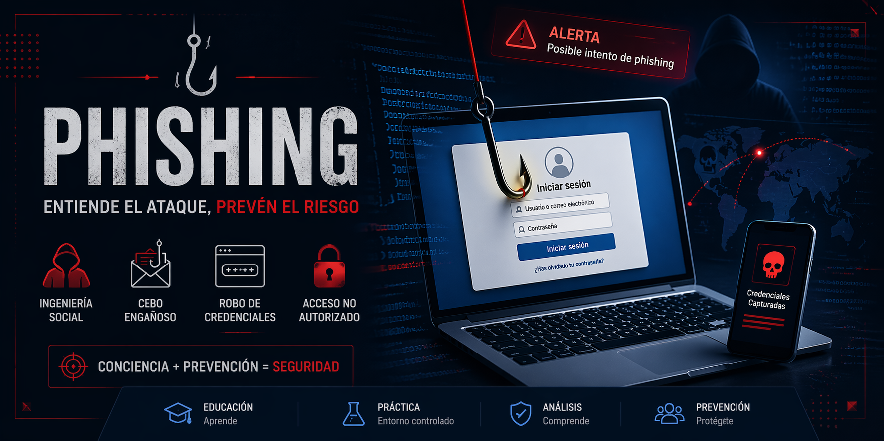

# 🛡️ Simulación de Ataque de Phishing con Zphisher (Entorno Controlado)

## 📌 Descripción del proyecto

Este repositorio documenta la simulación de un ataque de phishing utilizando la herramienta :contentReference[oaicite:0]{index=0} en un entorno controlado de laboratorio.

El objetivo del proyecto es analizar el funcionamiento técnico de los ataques de phishing, comprender los factores que influyen en su éxito y evaluar la interacción del usuario ante este tipo de amenazas.

⚠️ **IMPORTANTE:**  
Este proyecto tiene fines exclusivamente educativos.  
No debe utilizarse en entornos reales ni contra terceros sin consentimiento.

---

## 🎯 Objetivos

- Comprender el funcionamiento de un ataque de phishing  
- Analizar la herramienta Zphisher  
- Simular un escenario real en entorno controlado  
- Evaluar el comportamiento del usuario ante el ataque  
- Concienciar sobre riesgos de ingeniería social  

---

## 🧪 Entorno de laboratorio

### 🔹 Infraestructura

- **Máquina atacante:** Kali Linux (máquina virtual)  
- **Dispositivo víctima:** PC o smartphone  
- **Red:** Red local (NAT / red interna)  

### 🔹 Características

- Entorno aislado  
- Sin exposición a Internet (opcional según prueba)  
- Uso de credenciales ficticias  

---

## 🛠️ Herramienta utilizada

### 🔹 Zphisher

Zphisher es una herramienta de código abierto orientada a la automatización de ataques de phishing mediante el uso de plantillas predefinidas.

### 🔹 Características principales

- Clonado de páginas web  
- Captura de credenciales  
- Generación de enlaces de phishing  
- Automatización del despliegue  

---

## ⚙️ Metodología

El proceso seguido en la simulación se basa en las siguientes fases:

1. **Reconocimiento**  
   - Identificación del objetivo  

2. **Preparación del ataque**  
   - Selección de plantilla  
   - Configuración del entorno  

3. **Despliegue**  
   - Ejecución de la herramienta  
   - Generación del enlace  

4. **Interacción**  
   - Acceso desde dispositivo víctima  
   - Introducción de credenciales simuladas  

5. **Captura de datos**  
   - Registro de credenciales  

---

## 🚀 Ejecución (alto nivel)

> ⚠️ Se omiten detalles sensibles para evitar uso indebido.

- Ejecutar la herramienta en Kali Linux  
- Seleccionar plantilla de phishing  
- Levantar servidor local  
- Generar enlace de acceso  
- Acceder desde dispositivo víctima  
- Analizar resultados obtenidos  

---

## 📊 Resultados

Durante la simulación se ha observado:

- Alta facilidad de despliegue  
- Realismo de las páginas generadas  
- Captura inmediata de credenciales  
- Dependencia del factor humano  

---

## 🎥 Demostración en vídeo

Puedes ver la explicación completa y la demostración práctica en el siguiente vídeo:

👉 [Ver vídeo en YouTube](https://youtu.be/KvGiAt162YA)

---

## ⚖️ Consideraciones éticas y legales

- Uso exclusivo en entorno controlado  
- No utilización de datos reales  
- Consentimiento del participante  
- Eliminación de datos tras la práctica  

El uso indebido de este tipo de herramientas puede constituir un delito.

---

## 🧠 Conclusiones

El phishing sigue siendo una de las técnicas más efectivas en ciberseguridad debido a su enfoque en la ingeniería social.

Herramientas como Zphisher demuestran que:
- No se requieren grandes conocimientos técnicos  
- El factor humano es el eslabón más débil  
- La concienciación es clave para la prevención  

---

## 👤 Autores

**Jose Manuel**
Estudiante / Analista en Ciberseguridad

**Víctor**
Estudiante

---

## ⭐ Licencia

Este proyecto se distribuye únicamente con fines educativos.
